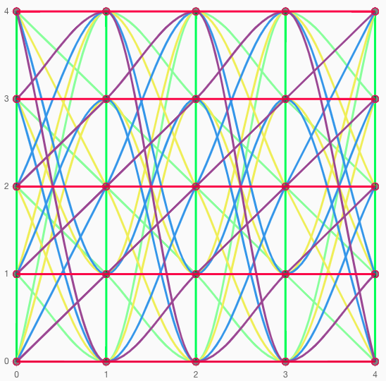

# Affine Break Out Room
Once upon a time, we wanted to split 21 people into reasonable sized groups over a couple of
rounds such that everyone see each other exactly once. We couldn't solve it. Few years later,
I looked back and realised that by using _affine planes_ it can be easily _solved_.

<div style="text-align:center">
    
    <p>Affine plane of order 5
</div>

An _affine plane_ is a concept in abstract algebra / geometry, which allows us to solve this
problem. Therefore, the name - _Affine Break Out Room_. More details
in the theory part.
```
Round 1: [0, 1, 2, 3, 4] [5, 6, 7, 8, 9] [10, 11, 12, 13, 14] [15, 16, 17, 18, 19] [20, N, N, N, N] 
Round 2: [0, 6, 12, 18, N] [5, 11, 17, N, 4] [10, 16, N, 3, 9] [15, N, 2, 8, 14] [20, 1, 7, 13, 19]
Round 3: [0, 11, N, 8, 19] [5, 16, 2, 13, N] [10, N, 7, 18, 4] [15, 1, 12, N, 9] [20, 6, 17, 3, 14]
Round 4: [0, 16, 7, N, 14] [5, N, 12, 3, 19] [10, 1, 17, 8, N] [15, 6, N, 13, 4] [20, 11, 2, 18, 9]
Round 5: [0, N, 17, 13, 9] [5, 1, N, 18, 14] [10, 6, 2, N, 19] [15, 11, 7, 3, N] [20, 16, 12, 8, 4]
Round 6: [0, 5, 10, 15, 20] [1, 6, 11, 16, N] [2, 7, 12, 17, N] [3, 8, 13, 18, N] [4, 9, 14, 19, N]
```
We are aware that there are other ways how to solve this problem, e.g. using _Kirkman
Triple System_, which can split 21 people into 7 groups over 10 rounds perfectly. Other
solutions are either inefficient (10 rounds per 3 people) or don't include all pairs. Therefore,
affine plane sounds like reasonable solution for small group sizes. For other group sizes, I
recommend to use [BoRAT](http://breakoutroom.pythonanywhere.com/allocate/) - a handy
tool with a nice [paper](https://www.mdpi.com/2073-8994/13/1/13) about it.

## References
[1] Pascoe, Abraham, "Affine and Projective Planes" (2018). MSU Graduate Theses. 3233.  
https://bearworks.missouristate.edu/theses/3233  
[2] Bartlett, Padraic, "Minilecture 5: Affine Planes" (2014).  
[http://web.math.ucsb.edu/padraic/ucsb_2013_14/mathcs103_w2014/mathcs103_w2014_lecture5.pdf](http://web.math.ucsb.edu/~padraic/ucsb_2013_14/mathcs103_w2014/mathcs103_w2014_lecture5.pdf)    
[3] von Gagern, Martin, "Affine Plane of Order 4 Picture?" (2016). Mathematics Stack Exchange.  
https://math.stackexchange.com/questions/1925479/affine-plane-of-order-4-picture  
[4] Kerl, John, "Computation in finite fields" (2004)."  
https://johnkerl.org/doc/ffcomp.pdf  
